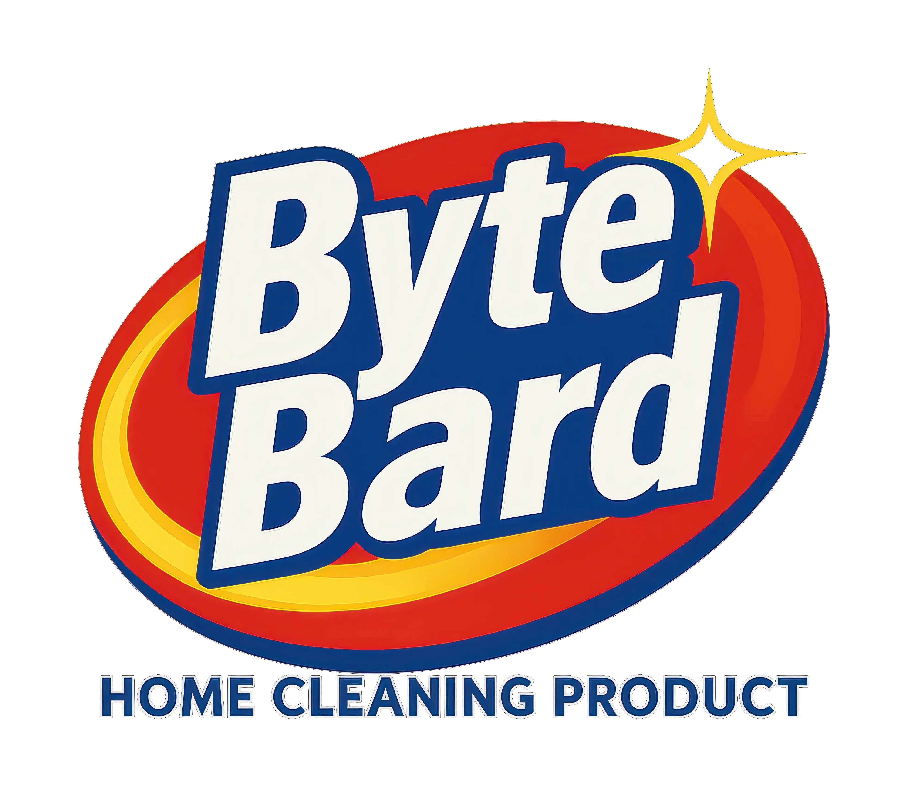

# 🎯 Interactive Presentation Build System

**Stop wrestling with PowerPoint. Build presentations like code.**

A powerful Python build system that creates beautiful, interactive HTML presentations with automatic asset optimization and dual output formats. Perfect for technical talks, code demos, and mathematical presentations.

## 🚀 Why This Exists

Ever tried to share a technical presentation over a phone call? Or wanted interactive demos in your slides? Or got frustrated with broken image links when moving presentation files around?

This build system solves all of that:

✅ **Phone-call ready** - Generates self-contained HTML files that work anywhere
✅ **Interactive demos** - JavaScript components built right into slides
✅ **Smart asset handling** - Reference images anywhere, automatic WebP optimization
✅ **Dual output** - Bundle for presentations, single file for sharing
✅ **Version controlled** - Everything is code, trackable in git

## 🎮 See It In Action

**Live Demo:** [bytebard97.github.io/embed-your-rings](https://bytebard97.github.io/embed-your-rings/)

This presentation about circular mathematics was built entirely with this system. Check out the interactive sliders, smooth navigation, and embedded assets.

## ⚡ Quick Start

```bash
# Clone and build the example presentation
git clone https://github.com/ByteBard97/embed-your-rings
cd embed-your-rings
pip install Pillow PyYAML
python build.py

# Opens two outputs:
# docs/index.html - Single file (works offline, perfect for sharing)
# docs/presentation_bundle/ - Full bundle (optimized for live presentations)
```

## 🛠️ How It Works

### 1. Write Slides as HTML
```html
<!-- slides/01-intro.html -->
<div class="slide">
  <h1>My Technical Talk</h1>
  
  <div id="interactive-demo"></div>
</div>
```

### 2. Add Interactive Components
```javascript
// js/my-demo.js
function initDemo() {
  // Your interactive code here
  // Automatically embedded in both output formats
}
```

### 3. Configure and Build
```yaml
# config.yaml
slides:
  - "01-intro.html"
  - "02-problem.html"
  - "03-solution.html"

build:
  webp_quality: 90
  max_image_width: 1920
```

```bash
python build.py
```

### 4. Get Two Perfect Outputs

**📱 Single File (`index.html`)** - 200-500KB
- Everything embedded (CSS, JS, images as base64)
- Works offline, perfect for email/Slack sharing
- No broken links ever

**🖥️ Bundle Folder (`presentation_bundle/`)**
- Separate optimized WebP assets
- Faster loading for live presentations
- Full quality images

## 🔥 Key Features

### Smart Asset Processing
- **Auto-discovery**: Reference images anywhere in your filesystem
- **WebP conversion**: 60-80% smaller files, same quality
- **Path resolution**: Handles complex relative paths automatically
- **Base64 embedding**: Single-file output works everywhere

### Interactive Components
- **JavaScript modules**: Drop files in `js/` folder, automatically included
- **Live demos**: Sliders, visualizations, interactive elements
- **Cross-format**: Works in both single-file and bundle outputs

### Build Intelligence
- **Dual output**: One command, two optimized formats
- **Asset manifest**: Track exactly what was processed
- **Error handling**: Clear messages when assets are missing
- **Caching**: Only reprocess changed assets

## 🎯 Perfect For

- **Technical presentations** with code examples and demos
- **Mathematical content** with interactive visualizations
- **Conference talks** that need to work offline
- **Training materials** with embedded exercises
- **Documentation** that doubles as a presentation

## 📊 Real Performance

The example presentation ([bytebard97.github.io/embed-your-rings](https://bytebard97.github.io/embed-your-rings/)):

- **17 slides** with complex mathematical content
- **Interactive demos** with real-time sliders
- **Optimized assets** including logos and diagrams
- **Single file**: 800KB (works offline)
- **Bundle**: 500KB + optimized assets

## 🏗️ Project Structure

```
your-presentation/
├── slides/           # HTML slide files
├── js/              # Interactive JavaScript modules
├── config.yaml      # Presentation configuration
├── build.py         # Main build script
├── asset_manager.py # Smart asset processing
├── styles.css       # Dark theme optimized for tech
└── docs/            # Generated outputs
```

## 🔧 Advanced Usage

### Multiple Presentations
```bash
python build.py config_technical.yaml    # Deep technical version
python build.py config_executive.yaml    # Executive summary
```

### Custom Asset Processing
```yaml
build:
  webp_quality: 95        # Higher quality for critical images
  max_image_width: 2560   # Support 4K displays
  single_file: false      # Skip single file if not needed
```

### GitHub Pages Deployment
The build system outputs directly to `docs/` folder - perfect for GitHub Pages:

1. Build your presentation
2. Commit to git
3. Enable GitHub Pages from `docs/` folder
4. Share the live link

## 💡 Why Not Just Use...?

**PowerPoint/Google Slides?**
- No version control, no interactive demos, sharing issues

**Reveal.js?**
- Manual asset management, no single-file output, complex setup

**LaTeX Beamer?**
- No interactivity, PDF-only, steep learning curve

**This system?**
- Code-like workflow, automatic asset handling, dual outputs, interactive demos

## 🤝 Contributing

This started as a personal tool for mathematical presentations but grew into something that could help other developers. If you find it useful:

- ⭐ Star the repo if it saved you time
- 🐛 Report issues with your use case
- 🔀 Fork it and make it work for your presentations
- 💡 Share cool examples of what you built

## 📜 License

MIT - Use it, modify it, share it. Just don't blame me if your presentation is boring 😉

---

**Built for developers who think presentations should be as version-controlled and reproducible as code.**

🔗 **Live Example:** [bytebard97.github.io/embed-your-rings](https://bytebard97.github.io/embed-your-rings/)
🔗 **Source:** [github.com/ByteBard97/embed-your-rings](https://github.com/ByteBard97/embed-your-rings)